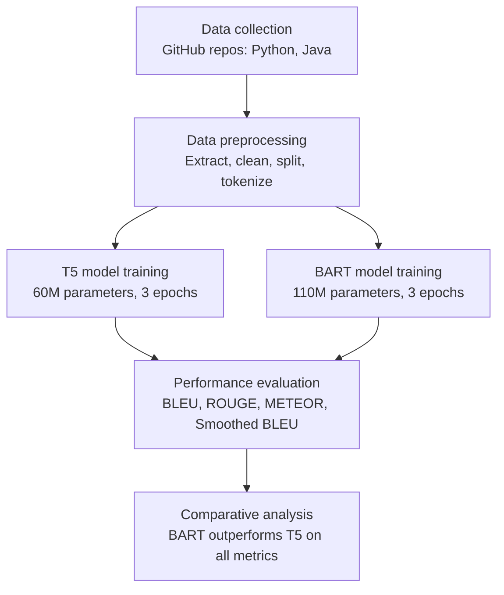
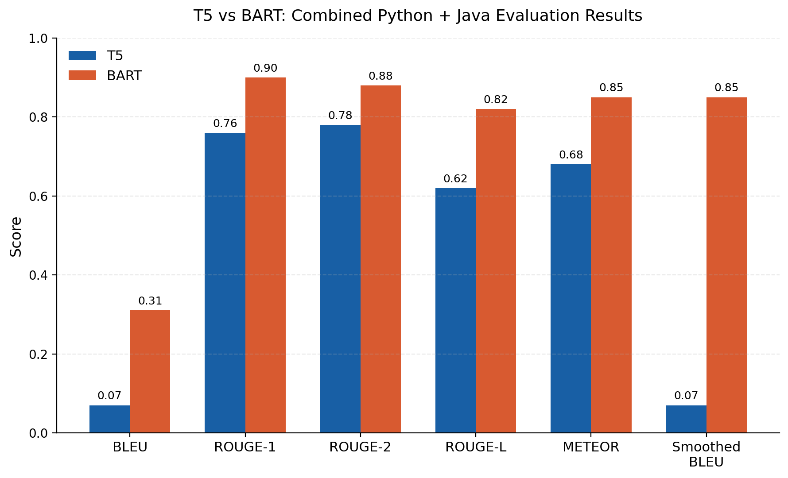

# Automated Code Comments Generation Using Large Language Models: Empirical Evaluation of T5 and BART

[](https://www.python.org/)
[](https://pytorch.org/)
[](LICENSE)
[](https://doi.org/10.1109/ACCESS.2025.3597601)

> Published in **IEEE Access, 2025** | DOI: [10.1109/ACCESS.2025.3597601](https://doi.org/10.1109/ACCESS.2025.3597601)

---

## Abstract

Source code documentation plays a significant role in the software development lifecycle, improving the comprehensibility and maintainability of software projects. Despite its importance, documentation is often dismissed or fails to meet expected standards. This research empirically evaluates two prominent open-source Large Language Models, **T5** (Google AI) and **BART** (Meta AI), for automating single-intent code comment generation on Python and Java code snippets.

We collected code-comment datasets from well-documented, high-popularity open-source GitHub repositories, fine-tuned both models, and rigorously evaluated their output using four key metrics: **BLEU**, **Smoothed BLEU**, **ROUGE** (1/2/L), and **METEOR**. The comprehensive analysis clearly highlights **BART as the superior model over T5** for single-intent code comment generation, while T5 offers a substantial training-efficiency advantage.

---

## Research Questions

| RQ | Question |
|----|----------|
| RQ1 | How can code comment generation be automated using LLMs such as T5 and BART? |
| RQ2 | How effective are LLMs, including T5 and BART, in automating code comments generation? |

---

## Study Design / Pipeline Overview




---

## Datasets

| Property | Python subset | Java subset |
|---|---|---|
| Source repositories | Django, Flask, Keras, Matplotlib, Pandas, Requests, PyTorch, Scikit-learn, TensorFlow | Spring Framework, JUnit, Apache Spark |
| Selection criteria | Popularity (≥1k forks/stars), active maintenance, domain diversity, ecosystem relevance | Same |
| Extraction method | AST-based docstring parsing | Regex-based block/line comment parsing |
| Split | ~70% train / 15% validation / 15% test | ~70% train / 15% validation / 15% test |

> **Note:** Raw cloned repositories and generated datasets are excluded from version control (see `.gitignore`). Run the data collection scripts below to regenerate them locally.

---

## Models and Metrics

**Models evaluated:**

| Model | Parameters | Architecture | Notes |
|---|---|---|---|
| T5 | ~60M | Encoder-decoder, text-to-text transformer | Faster training, lower compute footprint |
| BART | ~110M | Bidirectional encoder + autoregressive decoder | Higher comment quality, better generalization |

**Evaluation metrics:**

| Metric | Description |
|---|---|
| BLEU | n-gram precision against reference comments |
| Smoothed BLEU | BLEU with additive smoothing for short sequences |
| ROUGE-1 / ROUGE-2 / ROUGE-L | Unigram / bigram overlap and longest common subsequence |
| METEOR | Precision/recall harmonic mean with synonym and stemming matching |

---

## Repository Structure

```
EncoderDecoder_CodeComment/
├── README.md
├── .gitignore
├── .gitattributes
├── LICENSE
├── CITATION.cff
├── environment.yaml                # Conda environment definition
│
├── data_collection/                 # Dataset builder
│   ├── extract_python.py            # AST-based docstring extraction
│   ├── extract_java.py              # Regex-based comment extraction
│   ├── merge_and_clean.py           # Merge Python + Java, clean entries
│   ├── split_dataset.py             # 70/15/15 train/val/test split
│   ├── compare_test_data.py
│   ├── raw_cloned_repos/            # Ignored: cloned GitHub repos
│   ├── combined/                    # Python + Java combined dataset
│   ├── python_only/
│   ├── java_only/
│   └── json_full_dataset.json
│
├── T5_codecomment_Model/
│   ├── T5_codecomment_python_java/
│   │   ├── code/                    # Tokenize, train, infer, evaluate scripts
│   │   ├── models/                  # Fine-tuned checkpoints (gitignored)
│   │   ├── Tokenized_data/
│   │   └── evaluation_results/
│   ├── T5_codecomment_python/
│   └── T5_codecomment_java/
│
├── BART_codecomment_Model/
│   ├── BART_codecomment_python_java/
│   │   ├── code/
│   │   ├── models/
│   │   ├── Tokenized_data/
│   │   └── evaluation_results/
│   ├── BART_codecomment_python/
│   └── BART_codecomment_java/
│
└── results/
    ├── fig_results_comparison.png   # T5 vs BART metric comparison chart
    └── fig_pipeline_overview.png    # Colorized pipeline diagram
```

---

## Environment Setup

```bash
conda env create -f environment.yaml
conda activate codet5_bart
```

Required: Python 3.9+, PyTorch, Transformers, Datasets, SentenceTransformers, Evaluate, Scikit-learn.

---

## Reproducing Results

### 1. Dataset preparation

```bash
cd data_collection
python extract_python.py
python extract_java.py
python merge_and_clean.py
python split_dataset.py
```

Datasets generated in `data_collection/combined/`, `data_collection/python_only/`, `data_collection/java_only/`.

### 2. Tokenization

```bash
cd T5_codecomment_Model/T5_codecomment_python_java/code
python tokenize_t5_dataset_python_java.py
```

(Equivalent script under `BART_codecomment_Model/` for BART.)

### 3. Model training

```bash
python modeltrain_t5_python_java.py \
  --train_dataset_path "../Tokenized_data/train" \
  --valid_dataset_path "../Tokenized_data/valid" \
  --output_base_dir ".."
```

### 4. Inference

```bash
python inference_t5_python_java.py \
  --model_dir "../models/T5_Finetuned_model" \
  --test_dataset_path "../../../data_collection/combined/test_data.json" \
  --output_base_dir "../results"
```

### 5. Evaluation

```bash
python evaluate_t5_python_java.py \
  --predictions_path "../results/t5_python_java_generated_comments.json" \
  --test_path "../../../data_collection/combined/test_data.json" \
  --output_dir "../results/evaluation"
```

---

## Results

Evaluated on the combined Python + Java test set (3-epoch training):



| Metric | T5 | BART | BART improvement |
|---|---|---|---|
| BLEU | 0.07 | 0.31 | +343% |
| ROUGE-1 | 0.76 | 0.90 | +18% |
| ROUGE-2 | 0.78 | 0.88 | — |
| ROUGE-L | 0.62 | 0.82 | — |
| METEOR | 0.68 | 0.85 | +25% |
| Smoothed BLEU | 0.07 | 0.85 | +1,114% |

**Training efficiency:**

| Metric | T5 | BART |
|---|---|---|
| Final training loss | 0.0361 | 0.1475 |
| Final evaluation loss | 0.0085 | 0.00378 |
| Total training time | 128,225s | 178,752s |
| Samples/second | 1.079 | 0.774 |

**Key takeaway:** BART consistently outperforms T5 across every evaluation metric, in both languages and combined, showing stronger fluency, content overlap, and semantic fidelity. T5 trains ~39% faster and reaches a lower training loss, making it preferable for resource-constrained or rapid-iteration settings, while BART is the better choice when comment quality and generalization matter more than training cost.

---

## Notable Findings

- BART showed stronger syntactic fluency and semantic fidelity across all metrics and both languages.
- T5 trains significantly faster and suits resource-constrained, real-time use cases (e.g. IDE plugins).
- Both models capture high-level function intent well but omit deeper implementation details — better suited for real-time IDE assistance than comprehensive API documentation.
- No-repeat n-gram and beam size tuning significantly impacted BLEU and ROUGE scores.

---

## Threats to Validity

- **Dataset selection** — custom-built from selected GitHub repositories rather than a standard benchmark (e.g. CodeSearchNet), which may limit direct comparability.
- **Performance metrics** — BLEU/ROUGE/METEOR/Smoothed BLEU capture lexical overlap but not deep semantic fidelity; semantic-aware metrics (e.g. SIDE) were excluded due to resource constraints.
- **Model configurations** — smaller T5/BART variants were used for computational feasibility; results may not generalize to larger configurations (e.g. T5-large, BART-large).
- **Generalizability** — findings are specific to Python and Java and may not transfer to other programming paradigms.

---

## Future Work

- Integrate semantic-aware evaluation metrics (e.g. SIDE) alongside lexical metrics.
- Expand to additional programming languages beyond Python and Java.
- Explore larger model variants (T5-large, BART-large, CodeT5+) for multi-intent comment generation.
- Evaluate with human annotators.
- Extended results with longer training schedules (6 epochs) are explored in the accompanying thesis — see citation note below.

---

## Citation

If you use or build on this project, please cite the paper:

```
D. P. Ghale and M. Dabbagh, "Automated Code Comments Generation Using Large Language Models: Empirical Evaluation of T5 and BART,"
IEEE Access, vol. 13, pp. 141420–141433, 2025, doi: 10.1109/ACCESS.2025.3597601.
```

Paper link: https://ieeexplore.ieee.org/document/11122447

This repository also includes a `CITATION.cff` file — GitHub displays a "Cite this repository" button automatically.

---

## Authors

**Dhan Prasad Ghale** (Student Member, IEEE) — Master of Research, Melbourne Institute of Technology
**Mohammad Dabbagh** (Senior Member, IEEE) — Senior Lecturer, Melbourne Institute of Technology; Honorary Senior Lecturer, Macquarie University

---

## License

This repository is licensed under the MIT License — see [LICENSE](LICENSE) for details. The associated paper is published under a Creative Commons Attribution 4.0 License (CC BY 4.0).

---

## Acknowledgments

- Google AI – T5
- Meta AI – BART
- Hugging Face Transformers
- GitHub Open-Source Community
- Melbourne Institute of Technology

---

## Contribute

If you use or build on this project, feel free to open an issue or star the repo.
